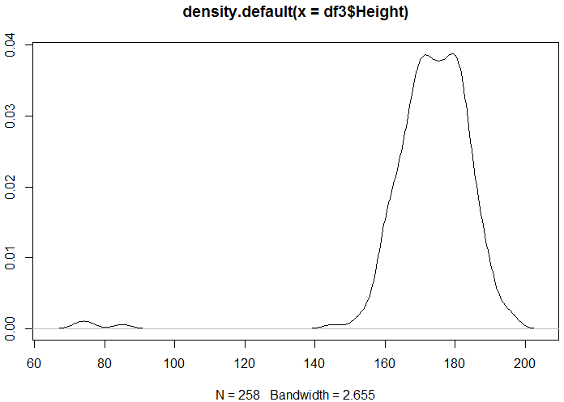
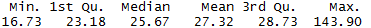
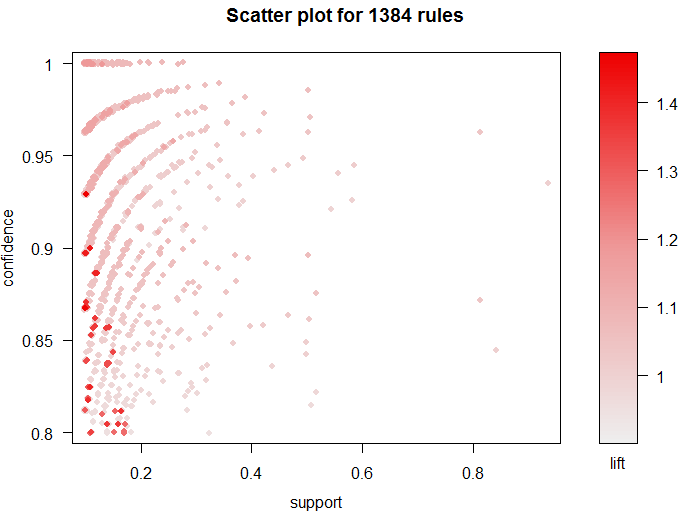

# Smokers_Data_Analysis_with_R

## Data analysis – Smokers dataset

The goal of this work is to find interesting data/patterns from a raw dataset (Dataset.csv). The excel file given are the response of 258 persons to 24 questions. Some question have simple answers, some contains a list of answers. The data are not normalized, so the first step of our study is to filter the data

This study is focused on two dataset. The first part has for goal to find interesting data/patterns from a raw dataset (Dataset.csv). The excel file given are the response of 258 persons to 24 questions. Some question have simple answers, some contains a list of answers. 
The second dataset is a series of observations made by a smocker : when he smoked and in which occasion. Using it we well build a shiny app to see interesting features interactively.

##Dataset.csv Study
The data are not normalized, so the first step of our study is to filter the data.

**Data Cleaning:**

- Some of values where missing, so we configured our import of the excel file to fill blank space with NA. Then we filled those NA with the most probable value (the value the most represented in the column)
- Weight cleaning: some weight were containing letters (kg) so we used a regex to remove them. We splited them in 3 categories :
  - 1= 60- (light)
  - 2= 60-90 (medium)
  - 3= 90+ (heavy)
- Height cleaning: some height contained letters and some were really low (6) so we did the same manipulation as for the weight, and scale up the really low values. We splited them in 3 categories :
  - 1= 140 (short)
  - 2= 140-180 (medium)
  - 3= 180+ (tall)
- Age Cleaning: we do 3 categories of age:
  - 1= 30 (Young)
  - 2= 30-50 (medium)
  - 3= 50+ (Senior)
- First cigarette cleaning: 4 categories
  - 1= 15- (VeryYoung)
  - 2= 15-21 (Young)
  - 3= 22-30 (Adult)
  - 4= 30+ (later)
- Gender cleaning: Female/Male has been changed to 1 / 2
- Phone cleaning: some different values were changed to match the other (uppercase difference for instance)
 
Education &amp; Family cleaning: both were converted to numerical 
 
- Health condition – Method to stop smoking – Reason to quit smoking: Those column where containing list, separated with coma and with false values. So we cleared the false values and separated each of the feature in a new column populated with corresponding TRUE/FALSE statement
- Reduce or stop smoking : String cleaning of truncated ones
- Contry: Contry grouped in 3 categories
  - 1= Other
  - 2= UK
  - 3= US
- Cigarette Everyday: we decided to split the set in 4 categories
  - 1= I do not smoke everyday
  - 2= 10 or fewer
  - 3= 20-30
  - 4= 31 or more
- After wake up cigarette: We spited the set in 4 categories
  - 1= within 5 minutes
  - 2= 5-60min
  - 3= 60min or more
  - 4= 2h or more
- Last time stop smoking: 4 categories
  - 1= 1 month
  - 2= 1 year
  - 3= 5 years ago
  - 4= Never tried
- Stop using the method listed: 3 categories
  - 1= No
  - 2= Short break
  - 3= Reduce
- Friends &amp; Family: 5 categories
  - 1= Non-smokers
  - 2= Social smokers
  - 3= Moderate
  - 4= Heavy smokers
  - 5= Other
- Brand of cigarettes: just converted to numerical: 
 
- Type of cigarette Box:
  - 1: Roll up
  - 2: 20 per pack (and the one which said 20)
- Own lighter:
  - 1: Not important
  - 2: Vital
- Salary:
  - 1: Not told
  - 2: 1000-
  - 3: 1000-5000
  - 4: 5000-10000
  - 5: 10000+
- Health:
  - 1: Healthy
  - 2: Major problem
  - 3: Minor problem
- Wanting to reduce or stop:
  - 1: No
  - 2: Reduce
  - 3: Stop
- Finally we convert all the table to numerical and rename the column

**Data Analysis:**

Some statistics:

- Gender
  - As we can see a majority of the people of the dataset are male (label 2: 73%)

- Education
  - As we can see there is more undergratuated(label 3 : 53.3%), then comes the one graduated (label 1 : 32.6%)  and finaly High school and vocational training(15.1%)

- Age
  - We can see that the people answering the questions are for a lot of them between 20 and 40

  - The repartition is :

  - Std

- Weight
  - A big part of the set is between 60 and 90 kg

  - The repartition is :

  - Std

- Height
  - The set is for the most between 160 and 190cm

  - The repartition is :

  - Std

- BMI
  - BMI for most between 25 and 35

  - The repartition is :

  - Std

Some link between data:

- We can see that men seem to tend to start earlier than woman (for this set at least)
- We can also see that the people starting to smoke the earlier tend to smoke a lot alter (here the 4rth categorie is between 21 and 31 per day)

We also did a pair of most our data to visualise eventual clusters:

Correlation matrix:

Link we could see with that matrix:

- Gender-Weight (0.62): As we could expect gender and weight are correlated
- BMI-Height (0.66): By contruction they are indeed linked, it is verified by the correlation (same as the weight)
- WakeUpCigarette-CigaretteEveryday (0.59): More interesting the moment you take your first cigarette seem to be correlated with the number of cigarette you consume everyday (the people starting to smoke earlier each day tend to smoke more cigarettes)

Then using the **apriori** algorithm:

- The people taking they first cigarette of the day later tend to be the healthier

The rules generated look like this:

- Some logical result can be seen here: the people wanting the reduce or stop smoking ( QuitOrReduce=2 or 3) managed to stop smoking for a short period (SucessfulStop=2). It seems to show that motivation is important

We also tried other method:

- Clustering with medoids (here for BMI)

- Clustering with KMean :

(10 clusters)

- The result of those 2 methods where not really successful

We can say that using R to see correlation in those data was interesting because it helped us to identify link we could not have seen with our bare eyes. Nonetheless, that study also showed us how hard and long the process of data cleaning is (it represented dozens of hour of work), and how experience, to know &quot;where to find&quot; can be useful.

##userdata.csv Study

The dataset given here is again linked with smoker. A brand of connected lighter collected data about the usage of their lighter. The lighter have 7 different modes:

- Observation week
- Cheated
- Friend
- Ontime
- Skipped
- Snoozed
- Auto skipped

The dataset hitself is composed of 3 columns:

- The user ID
- The Mode of usage
- The moment of usage

# Data Processing:

- First of all we converted the given xls file to csv in order for R to be able to correctly open it. The new dataset is provided with this zip.
- Then we began to work on the raw data:
  - We created a dataframe impoting the csv file in R
  - We separated the hour:minutes from the column time to a new column &quot;TimeHourMin&quot;
  - We set the type of the column &quot;Time&quot; do date
  - We extracted the Day of Week to a column &quot;DayOfWeek&quot; (1 is Sunday, 2 is Monday…)
  - We extracted the day number to a column &quot;DayNumber&quot;
  - We extracted the week number to a column &quot;WeekNumber&quot;
  - We created a column &quot;TimeInterval&quot; corresponding to:
    - 1 is 6 to 11h59
    - 2 is 12 to 17h59
    - 3 is 18h to 23h59
    - 4 is 00h to 5h59
- We created functions to fulfill our needs:
  - 2 functions were created to reset vectors (put 0 in all the element of the list or a Boolean false
  - A big function was created to extract all the data we needed. It loop over the full dataset and return all the list of element we need. It takes some minutes to generate them. Returned object:
    - The user List (from 1 to 32 here)
    - The total of cigarette smoked by user (32 elements with a number in each)
    - The total of cigarette smoked for each mode (32 lines and 7 column, one for each mode, the mode being ordered with the same order as it given previously in that document)
    - A list containing 3 list:
      - The list of days (from 1 to seven but ordered differently)
      - The list contains the number of day the user smoked (32 lines, 7 column, each element representing for example : user 1 smoked on 7 Mondays)
      - The list containing the total of cigarette smoked for each day (32 lines and 7 column too)
        - Those lists will be used to calculate the mean per day per user
    - A list containing 2 list:
      - The list of intervals (from 1 to 4 but ordered differently)
      - The total of cigarette smoked for each interval (32 lines and 4 column)
    - A list containing 2 lists:
      - The list of weeks (from 23 to 44 here)
      - The total cigarette smoked per week (32 lines, 21 columns)
    - A list containing the number of cigarette smoked by each user for the 7 last days (32 lines, 1 column containing a number)
    - A list containing the number of cigarette by interval of time and week day (32 elements of 4 intervals rows and 7 day column)
  - All those features extracted are then used to answer to the different question given

But as we decide to only talk of cigarette &quot;smoked&quot; **we exclude the categories friends, auto skipped** , **skipped and snoozed** which gives us:

**Total per Mode:**

**Mean of cigarette smoked each day:**

(1 is Sunday)

**Standard Deviation per day:**

**Number of consumed cigarette for the last 7 days:**

**Statistics on mode :**

- We chose to represent the percentage of each mode by user

- Here we can see that the user 27 only used his lighter in observationnal week or for his friend so maybe he is not a smocker, or maybe he stoped right after the first week

**Improvement between week 1 and2:**

**Smoking patern:**

- We created the function &quot;giveMeFullMeanLabelledIntervalDayDF&quot; which takes the return list from the principal function as a parameter (and the element of that list as a number, the user id and the number of column of the matrix) and returns a dataframe showing the mean of cigarette smoked for that user by day by interval of time

So if we take the User 1 for example :

(1 is Sunday)

We can see that it seem logical that the mean cigarette smoke il low for period 4 since it is between 0 and 6 so the night. We can also see that this people tend to smoke more on the day rather than the evening.

Here is a plot of the surface defined by this matrix:

Period of the week were the people smoke the most:

- We create a function called &quot;fctOnDataframe&quot; which takes a dataframe as argument and a function (here min or max) and returns the coordinates of the result (as row, column)

So if we continue our example on the user 1 (same data), our function returns:

When we compare it to the matrix:

- So for this user tend to smoke less the Sunday night (logical since it is the day before coming back to work) and he smokes the most on Thursday afternoon.

Other profile for example with user 2:

- His profile is quite different, he smokes more, but smoke the less the Saturday evening. He also tend to smoke more on the morning and moreover the Wednesday

**General All User Stats** :

- We create a dataframe which is the sum of the average cigarette smoke per day per period
- We use the previous studies done to classify the dataset

- We also generate a sum to see it more clearly

-
  - It seem that smokers tend to smoke more during the day than during the evening
  - The period they smoke the less is the night, and more particularly the Sunday night. We can correlate it with the first day of the work week being the Monday so the day after. This data must have been taken in a western country were the Sunday is a free day

Transposing the matrix gives us:

- Smokers seems to smoke more at the beginning of the working week (Monday and Tuesday)

- We then study the modes and construct a data frame which represent the 32 users and the sum for each mode:

As we can see the mode 7 (auto skipped) and 2(Cheat) are the most used by far. It shows us 2 tendencies:

- First the auto skipped appears a lot because the smoker don&#39;t always take his lighter with him
- Even if they use smart lighter, smokers are still tempted to cheat since they are addicted

After those mode come the mode 4 (On time)

- It seem logical that smokers use the possibility to smoke when they can

It is interesting to note that omitting the observation week, the next more used mode is the 5 (Skipped). It denotes a real motivation to reduce (or the incapacity to smoke at that moment)

# Conclusion

That study took us some time (mostly to create our list and statistics) but then using them let us see tendencies emerging from data. It shows us the interest of using computer softer to process data and our mind to create the model.