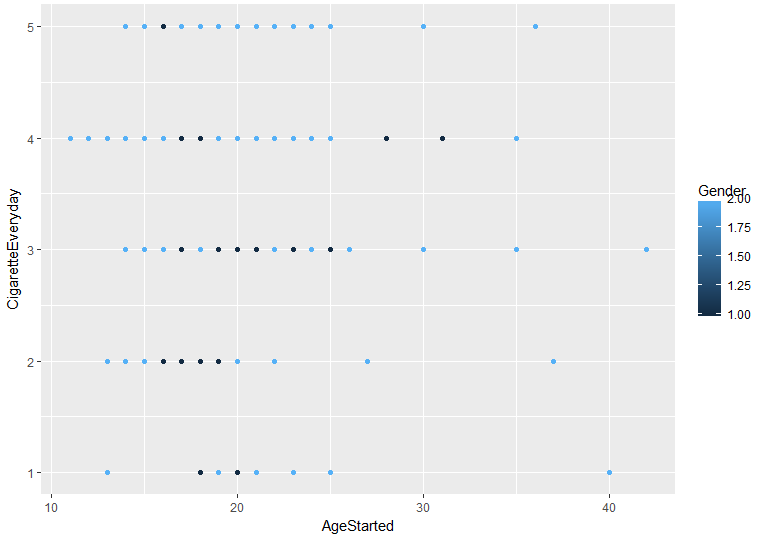

# Smokers_Data_Analysis_with_R

## Data analysis – Smokers dataset

The goal of this work is to find interesting data/patterns from a raw dataset. The excel file given are the response of 258 persons to 24 questions. Some question have simple answers, some contains a list of answers. The data are not normalized, so the first step of our study is to filter the data

**Data Cleaning:**

- Some of values where missing, so we configured our import of the excel file to fill blank space with NA. Then we filled those NA with the most probable value (the value the most represented in the column)
- Weight cleaning: some weight were containing letters (kg) so we used a regex to remove them. We splited them in 3 categories :
  - 1= 60- (light)
  - 2= 60-90 (medium)
  - 3= 90+ (heavy)
- Height cleaning: some height contained letters and some were really low (6) so we did the same manipulation as for the weight, and scale up the really low values. We splited them in 3 categories :
  - 1= 140 (short)
  - 2= 140-180 (medium)
  - 3= 180+ (tall)
- Age Cleaning: we do 3 categories of age:
  - 1= 30 (Young)
  - 2= 30-50 (medium)
  - 3= 50+ (Senior)
- First cigarette cleaning: 4 categories
  - 1= 15- (VeryYoung)
  - 2= 15-21 (Young)
  - 3= 22-30 (Adult)
  - 4= 30+ (later)
- Gender cleaning: Female/Male has been changed to 1 / 2
- Phone cleaning: some different values were changed to match the other (uppercase difference for instance)
 
Education &amp; Family cleaning: both were converted to numerical 
 
- Health condition – Method to stop smoking – Reason to quit smoking: Those column where containing list, separated with coma and with false values. So we cleared the false values and separated each of the feature in a new column populated with corresponding TRUE/FALSE statement
- Reduce or stop smoking : String cleaning of truncated ones
- Contry: Contry grouped in 3 categories
  - 1= Other
  - 2= UK
  - 3= US
- Cigarette Everyday: we decided to split the set in 4 categories
  - 1= I do not smoke everyday
  - 2= 10 or fewer
  - 3= 20-30
  - 4= 31 or more
- After wake up cigarette: We spited the set in 4 categories
  - 1= within 5 minutes
  - 2= 5-60min
  - 3= 60min or more
  - 4= 2h or more
- Last time stop smoking: 4 categories
  - 1= 1 month
  - 2= 1 year
  - 3= 5 years ago
  - 4= Never tried
- Stop using the method listed: 3 categories
  - 1= No
  - 2= Short break
  - 3= Reduce
- Friends &amp; Family: 5 categories
  - 1= Non-smokers
  - 2= Social smokers
  - 3= Moderate
  - 4= Heavy smokers
  - 5= Other
-
Brand of cigarettes: just converted to numerical: 
 
- Type of cigarette Box:
  - 1: Roll up
  - 2: 20 per pack (and the one which said 20)
- Own lighter:
  - 1: Not important
  - 2: Vital
- Salary:
  - 1: Not told
  - 2: 1000-
  - 3: 1000-5000
  - 4: 5000-10000
  - 5: 10000+
- Health:
  - 1: Healthy
  - 2: Major problem
  - 3: Minor problem
- Wanting to reduce or stop:
  - 1: No
  - 2: Reduce
  - 3: Stop
- Finally we convert all the table to numerical and rename the column

**Data Analysis:**

Some statistics:

- Gender
  - As we can see a majority of the people of the dataset are male (label 2: 73%)

- Education
  - As we can see there is more undergratuated(label 3 : 53.3%), then comes the one graduated (label 1 : 32.6%)  and finaly High school and vocational training(15.1%)

- Age
  - We can see that the people answering the questions are for a lot of them between 20 and 40

-
  - The repartition is :

-
  - Std

- Weight
  - A big part of the set is between 60 and 90 kg

  - The repartition is :

-
  - Std

- Height
  - The set is for the most between 160 and 190cm

-
  - The repartition is :

-
  - Std

- BMI
  - BMI for most between 25 and 35

-
  - The repartition is :

-
  - Std

Some link between data:

- We can see that men seem to tend to start earlier than woman (for this set at least)
- We can also see that the people starting to smoke the earlier tend to smoke a lot alter (here the 4rth categorie is between 21 and 31 per day)

We also did a pair of most our data to visualise eventual clusters:

Correlation matrix:

Link we could see with that matrix:

- Gender-Weight (0.62): As we could expect gender and weight are correlated
- BMI-Height (0.66): By contruction they are indeed linked, it is verified by the correlation (same as the weight)
- WakeUpCigarette-CigaretteEveryday (0.59): More interesting the moment you take your first cigarette seem to be correlated with the number of cigarette you consume everyday (the people starting to smoke earlier each day tend to smoke more cigarettes)

Then using the **apriori** algorithm:

- The people taking they first cigarette of the day later tend to be the healthier

The rules generated look like this:

- Some logical result can be seen here: the people wanting the reduce or stop smoking ( QuitOrReduce=2 or 3) managed to stop smoking for a short period (SucessfulStop=2). It seems to show that motivation is important

We also tried other method:

- Clustering with medoids (here for BMI)

- Clustering with KMean :

(10 clusters)

- The result of those 2 methods where not really successful

As a conclusion, we can say that using R to see correlation in those data was interesting because it helped us to identify link we could not have seen with our bare eyes. Nonetheless, that study also showed us how hard and long the process of data cleaning is (it represented dozens of hour of work), and how experience, to know &quot;where to find&quot; can be useful.

